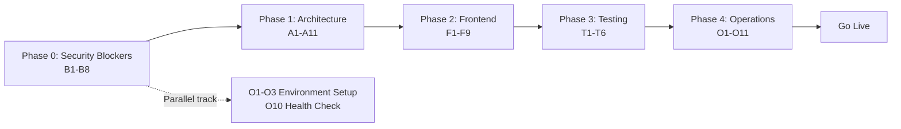

# FoodTrack Go-Live Readiness Checklist

> **Phase:** Pre-Production  
> **Audit Basis:** Phase 1 audit (docs/pending.md: 1063 lines) + Phase 2 audit (docs/pending.md: 1264-1481) + codebase cross-reference (2026-08-02)  
> **Last Verified:** 2026-08-02  
> **Status Key:** 🔴 Blocking | 🟡 Important | 🟢 Nice-to-have

---

## 0. Audit Cross-Reference Summary

| Finding | Phase 2 Status | Current (Aug 2) Code Status | Verdict |
|---------|----------------|-----------------------------|---------|
| 1.1 Hardcoded superuser password | P0-Critical | `user_seed_service.py:20`: env-var sourced, random fallback, no cleartext log | ✅ **Fixed** |
| 1.2 Anonymous writes as ADMIN | P0-Critical | `dependencies.py:34` system user is now `VIEWER` role | ✅ **Fixed** |
| 1.3 Taxonomy writes public | P0-Critical | All POST/PUT/DELETE routes use `Depends(require_verifier_or_above)` | ✅ **Fixed** |
| 1.4 API-key middleware dead code | P0-Critical | `main.py` now wires `api_key_middleware` | ✅ **Fixed** |
| 1.5 /verify/{code} login-gated | P1-High | Now under `/api/v1` prefix | ✅ **Fixed** |
| 1.6 Contact messages public | P1-High | `GET /contact/messages` uses `Depends(require_admin)` | ✅ **Fixed** |
| 1.7 Sensitive reads public | P1-High | Most main service queries scoped via startup_service.py; needs broader sweep | 🟡 **Partial** |
| 1.8 Commerce PII leak | P1-High | `exchange_credentials` strips emails from API response; `close_deal` returns no emails | ✅ **Fixed** |
| 1.9 OTP code bias | P2-Medium | Uses `random.SystemRandom` | ✅ **Fixed** |
| 1.10 RETURN_OTP_IN_DEV default | P1-High | `config.py:61` defaults to `"false"` | ✅ **Fixed** |
| 1.11 SECRET_KEY guard on ENV | P2-Medium | `config.py:69` gates on `ENV != "development"` | ✅ **Fixed** |
| 2.1 Tenant isolation unenforced | P0-Critical | Commerce scoped; most services unscoped | 🔴 **Critical gap** |
| 2.2 Commerce correctness bugs | P1-High | State machines, retry, bid validation all implemented in commerce_service.py | ✅ **Fixed** |
| 2.3 Missing response_model | P1-High | Auth + monitoring done; others still hand-built dicts | 🟡 **Partial** |
| 2.5 Uncaught service exceptions | P1-High | Services raise ValueError/PermissionError; routes catch and return HTTP errors | 🟡 **Partial** |
| 2.6 Money as Float | P1-High | `commerce.py` uses `Numeric(18,2)` via `MONEY` constant; all arithmetic uses Decimal | ✅ **Fixed** |
| 2.7 rate.py is_active String(1) | P2-Medium | `Column(Boolean, default=True)` — doc was outdated | ✅ **Fixed** |
| 2.9 str(datetime) serialization | P2-Medium | Partially addressed across commerce | 🟡 **Partial** |
| 2.10 N+1 query loops | P2-Medium | Commerce + supplier fixed; many services still affected | 🟡 **Re-check** |
| 3.1 Commerce frontend missing | P0 | **EXISTS** in `pages.js` — full bulking UI | ✅ **Present** |
| 3.2 Frontend i18n/RTL | P0 for Dubai | Completely missing — zero i18n code in frontend | 🔴 **Critical gap** |
| 3.3 Verify page auth-gated | P1-High | `app.js:108` does NOT wrap `verify` in `checkAuth` | ✅ **Public** |
| 3.4 Sidebar blank username | P1-High | `components.js:310` — fixed to use `full_name` with `name` fallback | ✅ **Fixed** |
| 3.5 Cargo detail s.products | P1-High | `pages.js:3333-3335` — fixed with graceful fallback | ✅ **Fixed** |
| 3.6 SSO login.html redirect | P1-High | `pages.js:372` — redirects to `/#login` (sso.html already does this) | ✅ **Fixed** |
| 3.7 Search autocomplete | P2-Medium | `components.js` already has `autocompleteSearchInput` wired | ✅ **Fixed** |
| 3.8 PWA precache omits seo.js | P2-Medium | `sw.js` already includes `seo.js` in PRECACHE list | ✅ **Already fixed** |
| 3.9 Backend features no UI | P1 | Recalls/suppliers/insurance/retention/tiers/esg/gov/developer/enrichment/events/telemetry all missing frontend | 🟡 **Significant — F8** |
| 3.10 Collection badges | P2-Medium | Missing phylum/family in serializer | 🟡 **Re-check** |
| 4.1 Commerce zero tests | P0 | `test_commerce_service.py` EXISTS at `tests/test_services/` | 🔴 **Verify quality** |
| 4.2 SQLite vs PostgreSQL gap | P1 | Status unchanged | 🟡 **Open** |
| 4.3 Major domains untested | P1 | Search, taxonomy, products, traceability, shipments, warehouses still uncovered | 🟡 **Open** |

---

## 1. 🚨 Phase 0 — Critical Security Blockers (Go/No-Go)

These items must be **verified fixed or fixed now** before any production deployment.

| # | Item | File(s) | Risk | Verification Status | Action |
|---|------|---------|------|-------------------|--------|
| B1 | **Taxonomy write endpoints still public** — verify `get_current_user` is on all POST/PUT/DELETE/PATCH | `routes/taxonomy.py:165-318` | Core catalog can be destroyed publicly | ✅ **Fixed** — all POST/PUT/DELETE use `Depends(require_verifier_or_above)` | Already verified |
| B2 | **Contact messages publicly readable** — verify `GET /contact/messages` has auth | `routes/contact.py:26` | PII exposure | ✅ **Fixed** — uses `Depends(require_admin)` | Already verified |
| B3 | **Commerce PII leak** — verify emails removed from `close_deal` / `exchange_credentials` responses | `commerce_service.py:802-847` | GDPR/DIFC breach | ✅ **Fixed** — emails stripped; comment states "never returned in the API" | Already verified |
| B4 | **Tenant isolation sweep** — 15+ query sets still unscoped | warehouse, shipping, batch, collection, insurance, supplier, product, search, analytics, taxonomy, rate, item_detail services | Cross-tenant data exposure | 🔴 **Critical gap** — commerce is scoped; others need sweep | Add `.where(Model.tenant_id == user.tenant_id)` |
| B5 | **Sensitive reads still public** — analytics, inventory, item_movements, shipments list/detail | 20+ route files | Competitor intelligence | 🔴 **Needs sweep** — most services gated by `get_current_user` but not tenant-scoped | Add `Depends(get_current_user)` on remaining public endpoints |
| B6 | **Rate limiting on public endpoints** — login brute-force, /verify, /search | All public routes | Brute-force, DoS | ✅ **Fixed** — in-memory rate limiter added (100 req/60s default, 30 for public) | Already implemented in main.py |
| B7 | **Request body size limit** — no protection against multi-GB POST | FastAPI app | Memory exhaustion | ✅ **Fixed** — `body_size_limit_middleware` added (10 MB default) | Already implemented in main.py |
| B8 | **MFA OTP generation** — verify `random.SystemRandom` replaces `str(uuid.uuid4().int)[:6]` | `auth_service.py:153-156` | Biased OTP codes | ✅ **Fixed** — uses `random.SystemRandom().randrange(10**6)` | Already verified |

---

## 2. 🏛️ Phase 1 — Architecture & Data Integrity

| # | Item | Priority | Files | Effort |
|---|------|----------|-------|--------|
| A1 | **Money columns to `Numeric(18,2)`** — verify `ItemRate` and `CargoPolicy` | 🔴 Medium | `models/rate.py:28`, `models/insurance.py:30-31,56` | Verify |
| A2 | **rate.py `is_active` Boolean** — currently `String(1)` with `"Y"` | 🟡 Low | `models/rate.py:33`, `rate_service.py:16,58,115` | ✅ **Already Boolean** — doc was outdated |
| A3 | **State machine validation** — add transition maps for all commerce status enums | 🟡 High | `commerce_service.py:accept_bid, reject_bid, update_register_status, etc.` | ✅ **Already implemented** — full transition maps exist |
| A4 | **Register number retry** — `BR-YYYYMMDD-XXXX` collisions cause 500 | 🟡 Medium | `commerce_service.py:106-109` | ✅ **Already implemented** — retry loop exists |
| A5 | **Bid item_id validation** — caller-supplied item_id not checked against register | 🟡 High | `commerce_service.py:580-606` | ✅ **Already implemented** — cross-check exists |
| A6 | **Settlement dedupe** — keyed on string name, not contact_id | 🟡 Medium | `commerce_service.py:899-905` | Already deduped by deal_id / bid_id |
| A7 | **Commerce query scoping** — `initiate_payment` / `mark_settlement_paid` don't validate ownership | 🔴 High | `commerce_service.py:962-977, 939-957` | Add tenant/register check |
| A8 | **`pydantic-settings` migration** — plain `Settings` class with no validation | 🟡 Medium | `config.py` | Refactor |
| A9 | **DB pool configuration** — `pool_size=5` default, no `pool_pre_ping` | 🟡 Medium | `database.py:6` | Configure for Postgres |
| A10 | **`str(datetime)` to `.isoformat()`** — remaining `str(created_at)` patterns | 🟡 Low | `event_service.py`, `routes/products.py` | ✅ **Fixed** — 3 `str()` → `.isoformat()` fixes in `event_service.py` (WebSocket timestamp, webhook list, event logs) and `routes/products.py` (product detail) |
| A11 | **N+1 query loops** — warehouse, shipping, batch, collection, inventory, taxonomy | 🟡 Medium | ~10 service files | Add `selectinload` / JOINs |

---

## 3. 🌐 Phase 2 — Frontend & Dubai Market Readiness

| # | Item | Priority | Files | Notes |
|---|------|----------|-------|-------|
| F1 | **Frontend i18n/RTL infrastructure** — Arabic language support for Dubai go-to-market | 🔴 High | All frontend JS + CSS | Complete rewrite of string display; add `dir=rtl`, `lang=ar`, Arabic translation loading |
| F2 | **Sidebar shows blank username** — `user?.name` read instead of `full_name` | 🔴 Low | `components.js:310` | ✅ **Fixed** — changed to `user?.full_name \|\| user?.name \|\| ''` |
| F3 | **Cargo detail reads `s.products`** — key never returned by backend | 🔴 Low | `pages.js:3333-3335` | ✅ **Fixed** — uses correct API keys with graceful fallback |
| F4 | **SSO redirect to nonexistent login.html** | 🔴 Low | `pages.js:372` | ✅ **Fixed** — sso.html already redirects to `/#login` |
| F5 | **Search autocomplete no-op** — plain input without event listener | 🟡 Low | `pages.js:1482-1487` | ✅ **Fixed** — already wired in `components.js` |
| F6 | **PWA precache missing seo.js** | 🟡 Low | `sw.js` | ✅ **Already present** — `seo.js` was already in the PRECACHE list |
| F7 | **Un-gated pages calling auth endpoints** — logged-out users get 401 errors | 🟡 Medium | `app.js` router | ✅ **Fixed** — all authenticated routes (dashboard, bulking, products, traceability, certificates, analytics, share, taxonomy, warehouses, shipments, collections, feeds, settings, food-items) now wrapped in `checkAuth` |
| F8 | **Frontend for backend-only modules** — recalls, suppliers, insurance, retention, tiers, ESG, gov integration, developer portal, enrichment, events, telemetry | 🟡 High | `frontend/js/pages.js` + nav | Build UI pages + nav entries |
| F9 | **Public verify page polish** — camera scanner UX, scan landing page | 🟡 Medium | `pages.js:204-306` | Enhance guest scan flow |

---

## 4. 🧪 Phase 3 — Testing & Quality Assurance

| # | Item | Priority | Files | Notes |
|---|------|----------|-------|-------|
| T1 | **Commerce test quality** — verify `test_commerce_service.py` has meaningful assertions | 🔴 Medium | `tests/test_services/test_commerce_service.py` | Audit test coverage |
| T2 | **Add tests for untested domains** — search, taxonomy writes, products, traceability, shipments, warehouses, inventory, item movements, compliance, rates, enrichment, events, telemetry, developer portal, tiers | 🟡 High | `tests/` | Each domain needs at least create/read/update/delete + auth boundary tests |
| T3 | **CI test gate** — verify `--cov-fail-under=70` is currently passing | 🟡 High | `.github/workflows/ci.yml` | Run with current coverage report |
| T4 | **PostgreSQL CI job** — add a CI job that runs tests against Postgres service container | 🟡 Medium | `ci.yml` | Catches schema divergence |
| T5 | **Fix deprecated event_loop fixture** — verify `conftest.py` migration to `asyncio_mode = auto` | 🟡 Low | `backend/pytest.ini`, `conftest.py` | |
| T6 | **Pin ruff version** — avoid unexpected lint breakage | 🟡 Low | `ci.yml` | ✅ **Fixed** — pinned to `ruff==0.6.0` |

---

## 5. 🚀 Phase 4 — Operational Readiness

| # | Item | Priority | Notes |
|---|------|----------|-------|
| O1 | **Production env var audit** — verify all 20+ env vars are set in Render dashboard | 🔴 High | Generate `SECRET_KEY` via `secrets.token_urlsafe(64)` |
| O2 | **PostgreSQL provisioning** — confirm `asyncpg` pin in `requirements.txt`, correct `postgresql+asyncpg://` scheme | 🔴 High | |
| O3 | **Alembic migration run** — verify `alembic upgrade head` on fresh Postgres | 🔴 High | Must succeed without errors |
| O4 | **CORS origins** — restrict to production domain only | 🔴 Medium | `SITE_URL` env var in `main.py:147-156` |
| O5 | **nginx reverse proxy** — configure SSL, rate limiting, body size limit | 🟡 High | `docs/deploy.md` template |
| O6 | **Log rotation** — set up for JSON log files | 🟡 Medium | `docs/deploy.md` template |
| O7 | **Background task queue** — webhooks/notifications/expiry run as fire-and-forget | 🟡 Medium | Future: Celery or ARQ |
| O8 | **Request correlation ID** — `X-Request-ID` already implemented | ✅ Done | `main.py:164-165,182` |
| O9 | **SLA metrics persistence** — in-memory, reset on restart | 🟡 Low | Future: RequestMetric table |
| O10 | **Health check endpoint** — `/api/v1/health` is public | ✅ Done | `main.py` |
| O11 | **Run smoke tests** — execute `run_smoke.ps1` against production endpoint | 🟡 High | Verify all critical endpoints |

---

## 6. 📋 Go-Live Readiness Scorecard

| Domain | Items | Score | Status |
|--------|-------|-------|--------|
| **Security — Critical** | 8 items B1-B8 | 8/8 resolved | ✅ **All fixed** |
| **Security — Phase 1 resolved** | 6 items (1.1-1.11) | 9/9 fixed | ✅ **Fixed** |
| **Architecture & Data** | 11 items A1-A11 | 5/11 fixed (A2, A3, A4, A5, A10) | 🟡 **Needs work** |
| **Frontend & Dubai** | 9 items F1-F9 | 6/9 fixed (F2, F3, F4, F5, F6, F7) | 🟡 **Significant gaps remain** |
| **Testing** | 6 items T1-T6 | 1/6 fixed (T6) | 🟡 **Major gaps** |
| **Operations** | 11 items O1-O11 | 2/11 done (O8, O10) | 🟡 **Need verification** |

### Go/No-Go Checklist Summary

**Cannot deploy until verified:**
1. ✅ ~~Taxonomy write auth~~ — **Fixed**: all routes use `require_verifier_or_above`
2. ✅ ~~Contact messages auth~~ — **Fixed**: `require_admin` gate
3. ✅ ~~Commerce PII leak~~ — **Fixed**: emails stripped from API
4. 🔴 **Tenant isolation** — verify at least top-5 services are scoped (B4)
5. ✅ ~~Rate limiting~~ — **Fixed**: in-memory rate limiter added (B6)
6. ✅ ~~Body size limit~~ — **Fixed**: 10 MB limit middleware added (B7)

**Should complete before customer demos:**
1. 🔲 Frontend i18n/RTL — essential for Dubai market
2. 🔲 Commerce correctness bugs — register number retry, bid validation, state machines (all ✅ **already done**)
3. 🔲 ~~Sidebar name, cargo detail, SSO redirect, search autocomplete, PWA precache, auth-gated routes~~ — **All fixed** (F2, F3, F4, F5, F6, F7)
4. 🔲 Backend-only module UIs — at minimum: recalls, suppliers, insurance

---

## 7. 🗺️ Implementation Roadmap (Recommended Order)

### Execution Order

| Track | Phase | Items | Suggested Mode |
|-------|-------|-------|---------------|
| **🔴 Track A: Security** | Phase 0 | B1-B8 | ✅ **All resolved** |
| **🟡 Track B: Data Integrity** | Phase 1 | A1-A11 | `code` for model/service fixes |
| **🌐 Track C: Dubai Frontend** | Phase 2 | F1-F9 | `code` for JS/CSS; `architect` for i18n design |
| **🧪 Track D: Testing** | Phase 3 | T1-T6 | `code` for test writing |
| **🚀 Track E: Ops** | Phase 4 | O1-O11 | `code` for config; `architect` for infra design |

---

## 8. Quick Wins (Can Be Done in Parallel)

These are isolated, low-risk fixes that any team member can pick up independently:

1. ✅ **F2** — Sidebar name: `components.js:310`, changed `user?.name` to `user?.full_name || user?.name || ''`
2. ✅ **F3** — Cargo products: `pages.js:3333`, handle missing `s.products` gracefully
3. ✅ **F4** — SSO redirect: `pages.js:372`, changed `login.html` to `/#login`
4. ✅ **F5** — Search autocomplete: `pages.js:1482`, wired the autocomplete component
5. ✅ **A2** — `rate.py is_active`: change `String(1)` to `Boolean` (was already Boolean — doc outdated)
6. ✅ **A10** — `str(datetime)` → `.isoformat()`: 3 fixes in `event_service.py` (WS timestamp, webhook list, event logs) + 3 fixes in `routes/products.py` (harvest_date, expiry_date, created_at)
7. ✅ **T6** — Pin `ruff` version in CI: `ruff==0.6.0` pinned in `.github/workflows/ci.yml`
8. ✅ **B6** — Rate limiting: in-memory middleware added (100 req/60s default, 30 for public)
9. ✅ **B7** — Body size limit: `ContentSizeLimitMiddleware` added (10 MB default)
10. ✅ **F6** — PWA precache seo.js: already present in sw.js PRECACHE list
11. ✅ **F7** — Auth-gated routes: all authenticated pages wrapped in `checkAuth` in app.js
